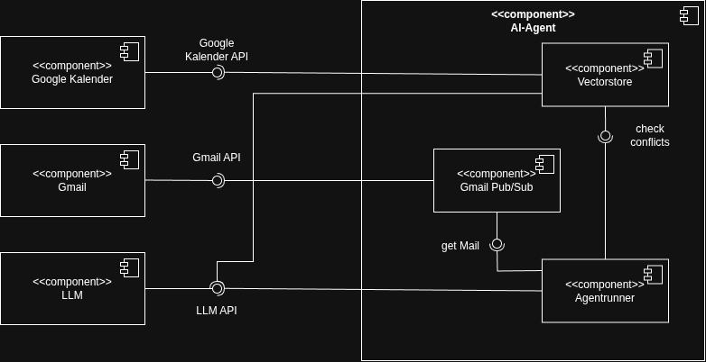
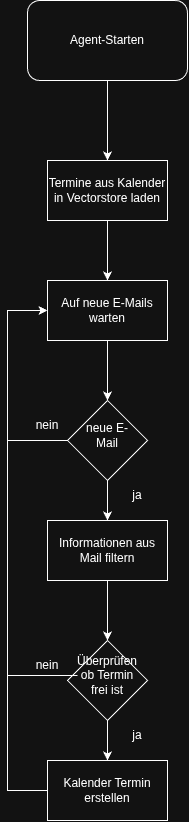
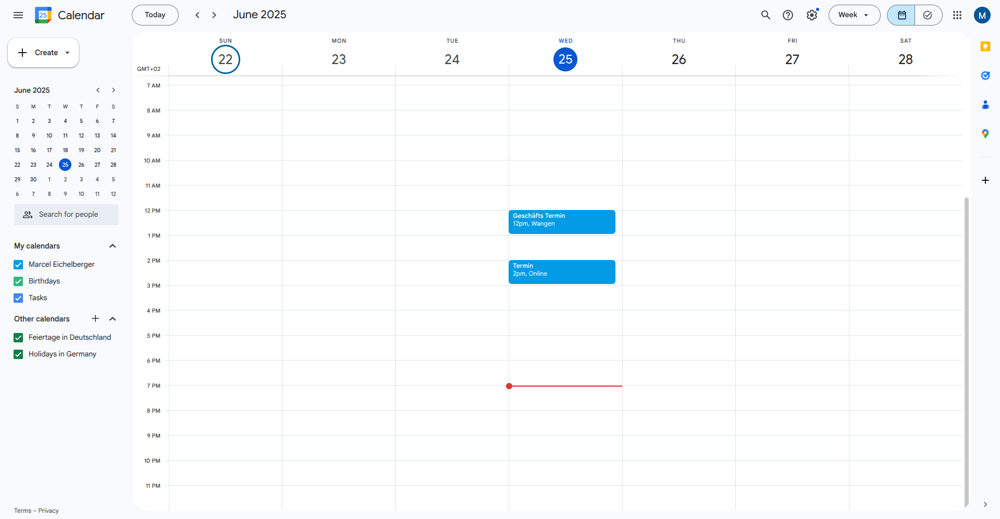

# Gmail-Agent

## Projektidee
Der Gmail-Agent ermöglicht es, automatisch erkannte Terminvorschläge aus E-Mails direkt in den Google-Kalender einzutragen. Nach der einmaligen Verknüpfung mit einem Google-Account empfängt und analysiert der Agent selbstständig neue E-Mails. Erkennt er dabei einen Terminvorschlag, extrahiert er alle relevanten Informationen und erstellt automatisch einen entsprechenden Kalendereintrag.

## Gruppenmitglieder
- Marcel Eichelberger
- Noah Preyer
- Manuel Walser
- Mike Lachmuth

## Was funktioniert
- Vektorstore mit bestehenden Kalenderterminen füllen
- Vektorstore wird mit neuen Kalenderterminen geupdatet
- Mails empfangen
- Termininformationen per LLM aus Mail filtern
- Überprüfen ob Termin belegt ist
- Kalendertermin mit wichtigsten Infos erstellen 

## Future plannings
- Falsche Uhrzeit in vom LLM erstellten Kalenderterminen (um 2h verschoben vermutlich wegen unterschiedlichen Zeitzonen)
- Falls Termin belegt in Kalender neuen Vorschlagen

## Architektur


## Programmablauf


## Quickstart Guide
### 1. Google Account erstellen

### 2. Google credentials.json
Um den diesen Agent zu nutzen, müssen die credentials eingerichtet werden. Am Ende muss eine **credentials.json** heruntergeladen werden.
- Google Cloud Konsole öffnen
- OAuth Zustimmungsbildschirm
- Dieser Anleitung folgen: https://developers.google.com/workspace/gmail/api/quickstart/python?hl=de#authorize_credentials_for_a_desktop_application
- credentials.json in google-credetnials.json umwandeln und in ./ai_agent_config speichern
- Unter Zielgruppe **App-Veröffentlichen**

### 3. Gmail- und Kalender-API aktivieren
- Öffne die Google Cloud Console
- Gehe zu **APIs & Dienste → API-Bibliothek**
- Suche und aktiviere:
  - Gmail API
  - Google Kalender API

### 4. `service_account.json` einrichten
- In der Google Cloud Console:
  - Unter **IAM & Verwaltung** ein Dienstkonto erstellen
  - Rolle: **Pub/Sub Subscriber**
  - Unter **Schlüssel → Schlüssel hinzufügen**
  - Typ: **JSON** auswählen, Datei wird heruntergeladen
- JSON-Datei in `google_service_account.json` umbenennen
- Datei in `./ai_agent_config` speichern

### 5. Publisher in der Cloud erstellen
- Google Cloud Konsole Öffnen 
- Cloud Shell starten
- Im folgendem Code dein-projekt-id auf die ID des Projekts ändern
```bash
gcloud pubsub topics add-iam-policy-binding gmail-notify \
  --member=serviceAccount:gmail-api-push@system.gserviceaccount.com \
  --role=roles/pubsub.publisher
projects/**dein-projekt-id**/topics/gmail-notify
```
- Bash Befehl in Cloud Power Shell ausführen 

### 6. token.json generieren
- ***generate_Tokens.py** ausführen

### 7. Agent starten
- Im Root-Verzeichnis des Projekt **docker compose up** ausführen
- Wird OpenAI verwendet: **docker compose up ai-mail-agent** 

### 8. Testen
- Sende eine Test-Mail von einem beliebigen Absender
- Der Agent erkennt Terminvorschläge in der Mail und erstellt automatisch einen Kalendereintrag

## Funktionalitäten
- Empfangen von E-Mails
- Analyse und Extraktion relevanter Daten
- Ausgabe im JSON-Format
- Automatische Erstellung von Kalendereinträgen im Google-Kalender

## Beispielausgabe

### Google-Kalender mit automatisch erstelltem Termin


## Herausforderungen
- Anbindung an das Google-Konto
- Zuverlässiges Empfangen neuer E-Mails
- API-Token-Limits
- Exakte Extraktion der wichtigsten Informationen aus E-Mails
